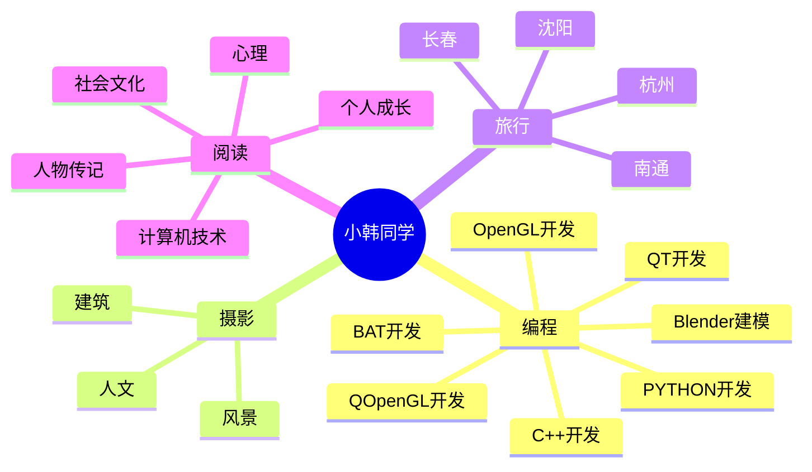

<div align="center">
  
  <!-- dynamic typing effect 动态打字效果 -->
  <div align="center">
    <a href="https://blog.sunguoqi.com/">
      
    </a>
  </div>

  <!-- knock code pictures 敲代码的图片 -->
  <br>

  <!-- profile logo 个人资料徽标 -->
  <div align="center">
    <a href="https://blog.csdn.net/qq_43331089?type=blog"></a>&emsp;
    <a href="https://github.com/cuttingdust/cuttingdust/blob/main/assert/WechatIMG1.jpeg"></a>&emsp;
    <a href="https://www.bilibili.com/"></a>&emsp;
    <a href="https://www.zhihu.com/creator"></a>&emsp;
    <!-- visitor statistics logo 访客数统计徽标 -->
    
  </div>

  <!-- Snake Code Contribution Map 贪吃蛇代码贡献图 -->
  

</div>

#  🙋 Hello

<table>
<tr><td>

<!-- About me 关于我 -->
### 🤺 About Me
  


<p>&emsp;&emsp;大家好，我是小韩同学。</p>
<p>&emsp;&emsp;热爱编程、摄影、读书、旅行。</p>
<p>&emsp;&emsp;热爱计算机科学和IT互联网事业，励志成为一名优秀的独立开发者。</p>
<p>&emsp;&emsp;我们正在让这个世界变得更加美好，通过代码的重复使用和延展构建完美体系。</p>
<p><strong>&emsp;&emsp;We're making the world a better place. Through constructing elegant hierarchies for maximum code reuse and extensibility.</strong></p>

</td></tr>

<tr>
<td>
  
### 🏢 Work Experience


- [杭州云甲科技](https://120.79.217.107/) &emsp; 📌 Todo
  
  - 工作岗位：C++ 软件高级工程师
  - 工作内容：3D软件相关

</td>
</tr>

<tr><td>

<!-- 近期博客 -->
### 📃 Recent Blog
  


<!-- START_SECTION:blog -->
* <a href='https://blog.sunguoqi.com/archives/brain' target='_blank'>小韩同学 の 第二大脑正在施工中 。。。</a> - 2023-06-07
* <a href='https://blog.sunguoqi.com/archives/20230225' target='_blank'>奔跑在自己的时区里，你好哇，我的22岁！</a> - 2023-10-12
* <a href='https://blog.sunguoqi.com/archives/wechat_mp' target='_blank'>请接受像“屎”一样的开始</a> - 2023-01-27
<!-- END_SECTION:blog -->

</td></tr>

<tr><td>

### 🧠 Second Brain


<!-- START_SECTION:brain -->
* <a href='https://brain.sunguoqi.com/life/coder/anthony-fu.html' target='_blank'>达克效应</a> - 2023-05-21
* <a href='https://brain.sunguoqi.com/life/coder/sxzz.html' target='_blank'>六顶思考帽</a> - 2023-05-21
* <a href='https://brain.sunguoqi.com/web/vue/hello/hello-vue.html' target='_blank'>Hello World</a> - 2023-05-21
<!-- END_SECTION:brain -->

</td></tr>

<tr><td>

### 🤾‍♂️ Funny Soul


<!-- START_SECTION:douban -->
* <a href='https://book.douban.com/subject/35193035/' target='_blank'>最近在读数字时代的效率手册</a> 🌟🌟🌟🌟🌟 力荐- 2023-04-17
* <a href='http://movie.douban.com/subject/1292052/' target='_blank'>看过重构</a> 🌟🌟🌟🌟🌟 力荐- 2023-02-07
* <a href='http://movie.douban.com/subject/35465232/' target='_blank'>在看狂飙</a> 🌟🌟🌟🌟🌟 力荐- 2023-02-07
<!-- END_SECTION:douban -->

</td></tr>

<tr><td>

<!-- wakatime 统计 -->
### 📊 WakaTime

<a href="https://wakatime.com/@cuttingdust"></a>&emsp;

<!--START_SECTION:waka-->
**I'm a Night 🦉** 

```text
🌞 Morning                213 commits         ████░░░░░░░░░░░░░░░░░░░░░   17.88 % 
🌆 Daytime                320 commits         ███████░░░░░░░░░░░░░░░░░░   26.87 % 
🌃 Evening                483 commits         ██████████░░░░░░░░░░░░░░░   40.55 % 
🌙 Night                  175 commits         ████░░░░░░░░░░░░░░░░░░░░░   14.69 % 
```
📅 **I'm Most Productive on Friday** 

```text
Monday                   202 commits         ████░░░░░░░░░░░░░░░░░░░░░   16.96 % 
Tuesday                  162 commits         ███░░░░░░░░░░░░░░░░░░░░░░   13.60 % 
Wednesday                128 commits         ███░░░░░░░░░░░░░░░░░░░░░░   10.75 % 
Thursday                 106 commits         ██░░░░░░░░░░░░░░░░░░░░░░░   08.90 % 
Friday                   315 commits         ███████░░░░░░░░░░░░░░░░░░   26.45 % 
Saturday                 142 commits         ███░░░░░░░░░░░░░░░░░░░░░░   11.92 % 
Sunday                   136 commits         ███░░░░░░░░░░░░░░░░░░░░░░   11.42 % 
```


📊 **This Week I Spent My Time On** 

```text
🕑︎ Time Zone: Asia/Shanghai

💬 Programming Languages: 
C++                      42 mins             ████████████░░░░░░░░░░░░░   49.73 % 
Git Config               19 mins             ██████░░░░░░░░░░░░░░░░░░░   22.45 % 
Python                   9 mins              ███░░░░░░░░░░░░░░░░░░░░░░   10.70 % 
TypeScript               5 mins              ██░░░░░░░░░░░░░░░░░░░░░░░   06.92 % 
HTML                     5 mins              ██░░░░░░░░░░░░░░░░░░░░░░░   06.70 % 

🔥 Editors: 
VS Code                  1 hr 24 mins        █████████████████████████   100.00 % 
Clion                    1 hr 24 mins        █████████████████████████   100.00 % 
XCode                    1 hr 24 mins        █████████████████████████   100.00 % 

💻 Operating System: 
Windows                  1 hr 24 mins        █████████████████████████   100.00 % 
mac                      1 hr 24 mins        █████████████████████████   100.00 % 
```


 Last Updated on 07/06/2023 01:50:13 UTC
<!--END_SECTION:waka-->
  
</td></tr>
</table>

<!-- ########################################## 分割 ########################################## -->


<div align="center" >




<!-- just img 图片 -->


<!--  skill badge 技能徽章 -->
💪 正在学习


  
🧠 计划学习


🧰 常用的工具


<!-- programming tool icon 编程工具图标 -->
<br>

<!-- svg -->


 


<br>

<!-- just img 图片 -->
</div>

<!-- profile-3d-contrib 3D贡献图-->

</div>

<!-- ########################################## 分割 ########################################## -->


<div align="center" >

<!-- Github-Stats-Terminal 终端风格信息 -->
<br>
  
<!-- Quotes 名人名言 -->
<br>
  
<!-- GitHub 奖杯🏆 -->
<br>

<!-- GitHub 数据统计 -->

<br><br>

<!-- Awesome repo 比较好的仓库-->
<a href="https://github.com/cuttingdust/FFEngine">
</a>
<a href="https://github.com/cuttingdust/irrlicht">
</a><br><br>
  
<!-- Wakatime Graph-->
<table>
  <tr>
    <td></td>
    <td></td>
  </tr>
  <tr>
    <td colspan="2"><a href="https://run.sunguoqi.com"></a><br></td>
  </tr>
</table>
</div>

<!-- ########################################## 分割 ########################################## -->


<div align="center">

<!-- run 图片 -->


<!-- Joke 笑话 -->
<div></div>

<!-- github-readme-streak-stats 连续提交代码天数记录 -->
&emsp;

&emsp;

<!-- Spotify 音乐 -->
&emsp;&emsp;&emsp;&emsp;

  &emsp;&emsp;&emsp;&emsp;

<!-- My Blog 博客首页 -->
&emsp;
<a href="https://blog.sunguoqi.com"></a>
&emsp;

<!-- GitHub Activity Graph GitHub 活动图 -->
<table align="center">
  <tr>
    <td></td>
  </tr>
</table>

</div>

<!-- ########################################## 分割 ########################################## -->


<!-- GitHub metrics 信息指标 -->
<div align="center">

<!-- just img 图片 -->


<!-- first form 第一个表格 -->
<table>
  <tr>
    <td></td>
  </tr>
</table>


<!-- just img 图片 -->

</div>
